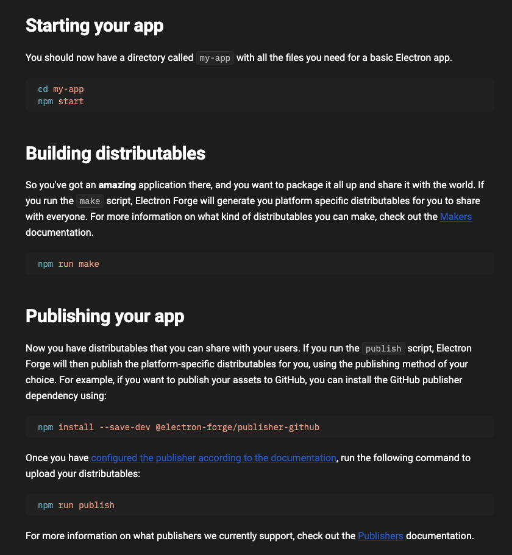

# MacTools

It's all about creating amazing tools for Mac.

### Planning Board:

**Features:**

- [*] Dark mode support
- [ ] Clipboard history
- [ ] User preference/settings

**Upcoming Features:**

- Yet to Plan

  ```shell
  The idea is to have cmd + v feature on mac similar to win + v
  ```

### Commands:


